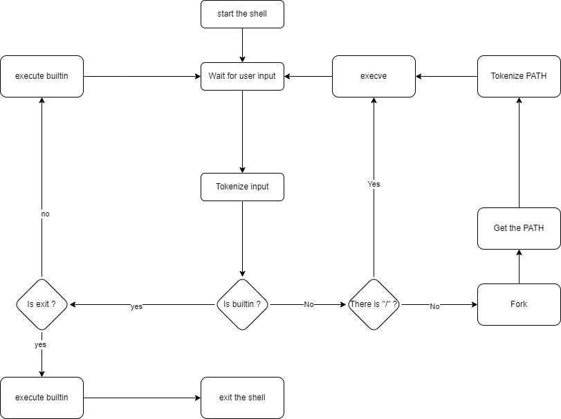

# Simple Shell

## Description
This project is a simple UNIX command interpreter that replicates the basic functionalities of the shell. It reads commands from the user, executes them, and displays the output.
## Flowchart

## Features
- Command execution with arguments
- Built-in commands implementation
- PATH resolution for commands
- Handle multiple commands with semicolon (;)
- Comments with #
- Error handling and appropriate exit codes
- Signal handling (Ctrl+C)
- Environment variable management

## Files
- `shell.c`: Core shell functionality including command processing and execution
- `main.c`: Entry point and main loop of the shell
- `builtin.c`: Implementation of built-in commands
- `_strcmp.c`: String manipulation functions
- `_strchr.c`: String searching and environment variable functions
- `split.c`: Command line parsing functions
- `help.c`: Help system implementation
- `shell.h`: Header file with prototypes and includes
- `panneau.c`: Welcome screen implementation
- `atoi.c`: String to integer conversion
- `testsuit.sh`: Test suite for shell functionality

## Usage
1. Clone the repository:
	```sh
	git clone https://github.com/maniok19/holbertonschool-simple_shell.git
	```
2. Compile the source files:
	```sh
	gcc -Wall -Werror -Wextra -pedantic *.c -o hsh
	```
3. Run the shell:
	```sh
	./hsh
	```

## Built-in Commands
- `cd [directory]`: Change the current working directory.
   - `cd -`: Change to the previous working directory.
   - `cd ~`: Change to the home directory.
- `exit [STATUS]`: Exit the shell with optinal status code.
- `env`: Print the environment variables.
- `help [command]`: Display help information for built-in commands.
- `setenv [VARIABLE] [VALUE]`: Set an environment variable.
- `unsetenv [VARIABLE]`: Unset an environment variable.

## Example
```sh
$ ./hsh
$ ls -l
total 8
-rwxrwxr-x 1 user user  0 Oct  1 12:34 file1
-rwxrwxr-x 1 user user  0 Oct  1 12:34 file2
$ env
PATH=/usr/local/sbin:/usr/local/bin:/usr/sbin:/usr/bin:/sbin:/bin
HOME=/home/user
$ exit 42
```
## Man page
To view the man page:

```man ./man_1_simple_shell```

## Authors
- Mano
- Sebastien

## License
This project is licensed under the MIT License.
